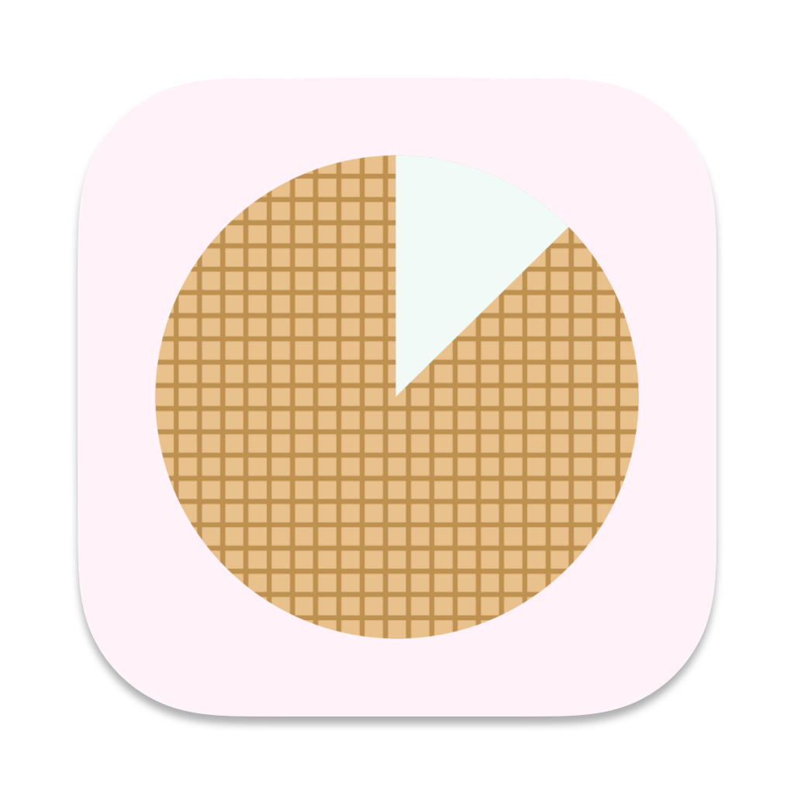
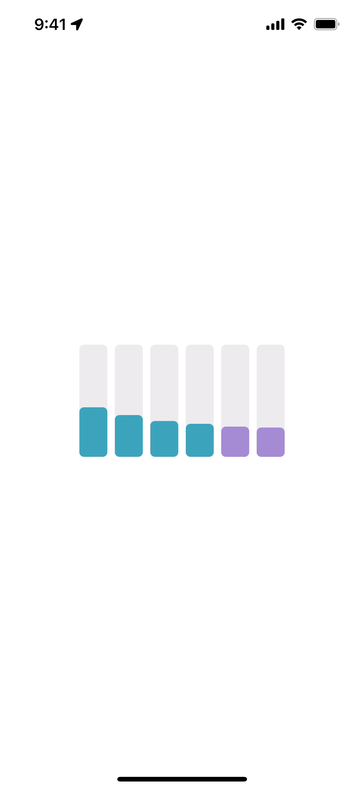

# Core Wafer 🧇

<div align="center">
    
</div>

Core Wafer is a package for capturing the CPU usage for each core of the Mac or the iPhone, like a CPU Usage window of Activity Monitor.app

On the iPhone and Apple Silicon Mac, Efficiency core (E-core) and Performance core (P-core) are displayed in different colors.

## Usage



```swift
import SwiftUI
import CoreWafer

struct ContentView: View {
  @ObserverdObject var processor = ProcessorObserver()
  
  var body: some View {
    WafersView(processor: processor)
      .onAppear {
        processor.start()
      }
  }
}
```

By using `ProcessorObserver` and `CoreTypeInformation`, you can also build your own View. Refer to [`WafersView`](./Sources/CoreWafer/WafersView.swift).

## Example

[Gaufre](https://github.com/Shakshi3104/Gaufre) is a macOS application powered by Core Wafer

<p align="center">
    
</p>

## Swift Package Dependencies

- [ProcessorKit](https://github.com/Shakshi3104/ProcessorKit)
- [DeviceHardware](https://github.com/Shakshi3104/DeviceHardware)